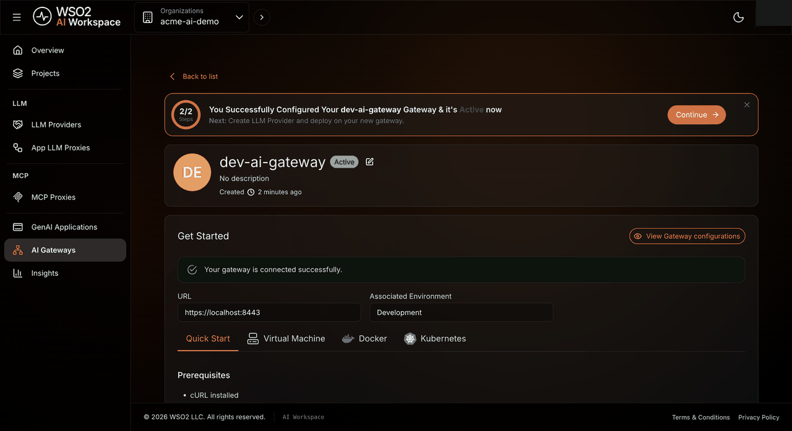
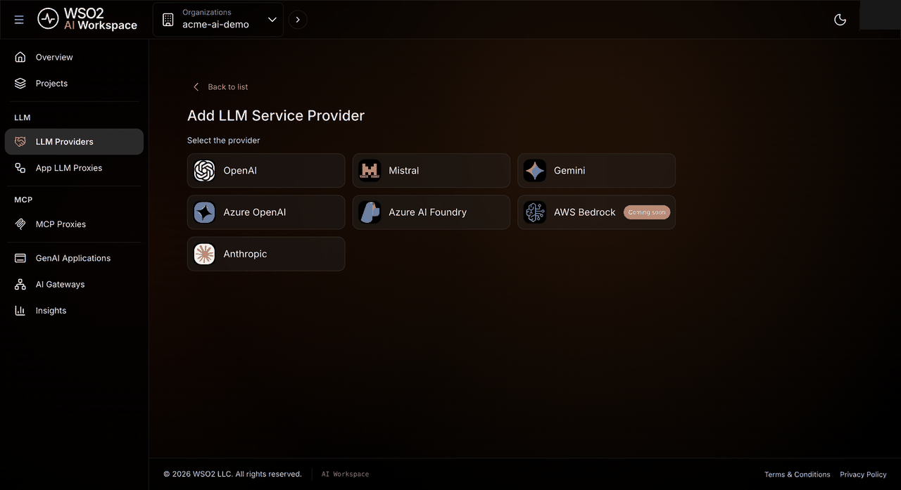
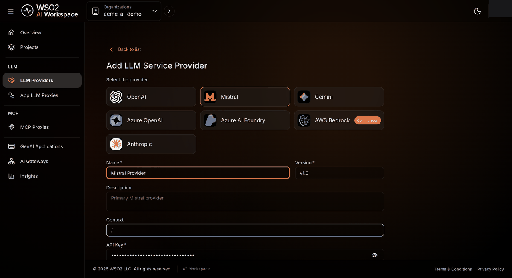
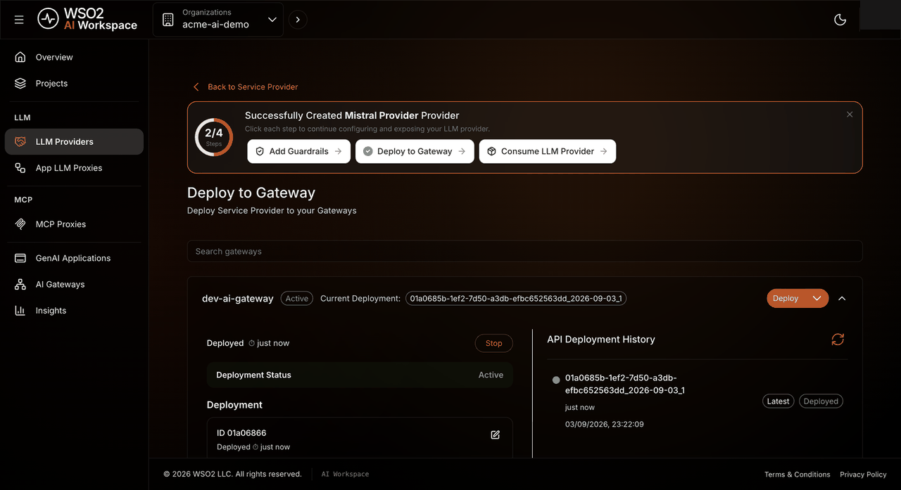
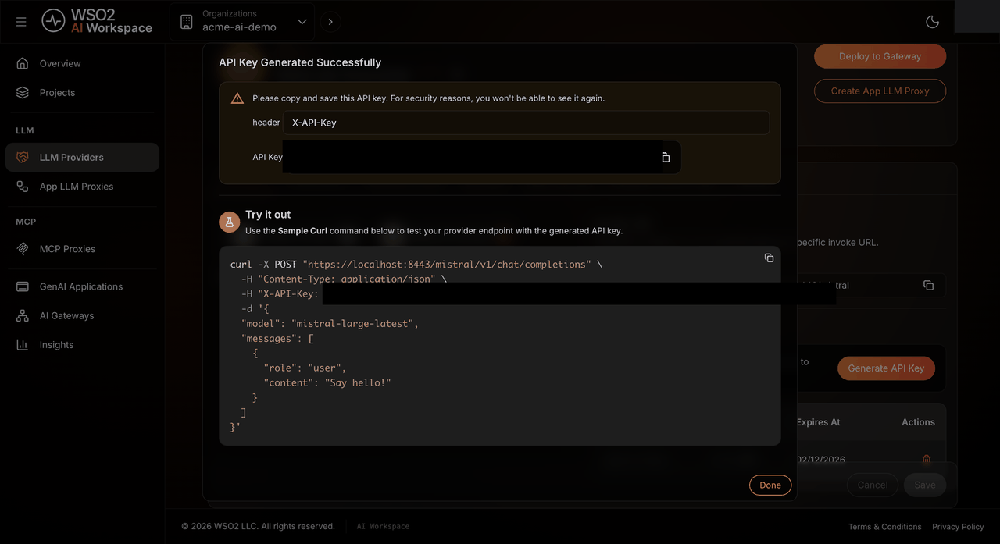
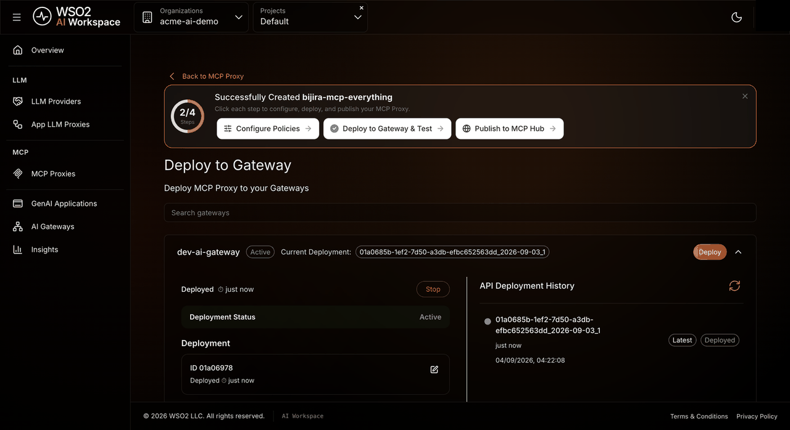
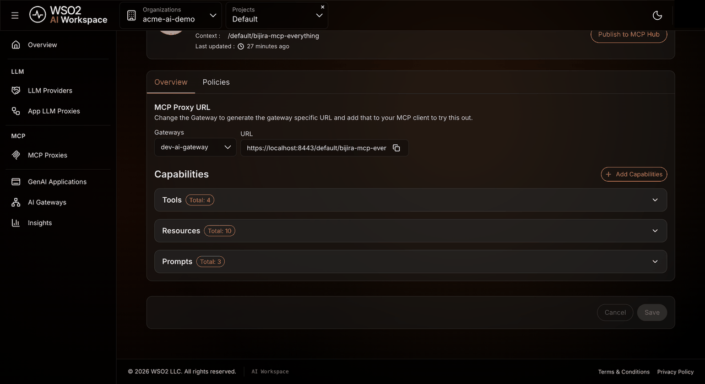

# AI Workspace quickstart

AI Workspace puts a governed AI Gateway between your applications and the AI services they call: large language model (LLM) providers and Model Context Protocol (MCP) servers. Every request is authenticated, controlled, and observable from one place.

In this quickstart, you run an AI Gateway, then connect it to two kinds of AI services: an LLM provider that answers chat requests, and an MCP server that exposes tools. By the end, you'll have sent a real request to each one through your gateway and confirmed it works.

## Overview

This quickstart guides you through:

1. [Set up your workspace](#part-1-set-up-your-workspace): create an organization in the Console.
2. [Run an AI Gateway](#part-2-run-an-ai-gateway): register a gateway and start it on your machine.
3. [Route an LLM provider](#part-3-route-an-llm-provider): connect a provider, deploy it, and send a chat request.
4. [Route an MCP server](#part-4-route-an-mcp-server): proxy a sample MCP server, deploy it, and call a tool.

It's intended for developers and platform engineers. No prior WSO2 API Platform experience is needed. For background on the concepts it uses, see the [AI Workspace overview](overview.md).

The result is one AI Gateway that fans out to both back ends. AI Workspace is hosted by WSO2, but the gateway itself runs on infrastructure you choose:


Three URLs matter in this quickstart. AI Workspace shows you each one exactly when you need it, so you never build them yourself: the gateway's own address (Part 2), the provider's **Invoke URL** (Part 3), and the MCP proxy's **URL** (Part 4).

You reach both hosted parts, the **Console** and **AI Workspace**, from [console.bijira.dev](https://console.bijira.dev/): the Console directly, and AI Workspace from its link in the Console's top navigation. The only thing you run yourself is the AI Gateway.

## Before you start

Complete the following prerequisites:

* A WSO2 API Platform account: sign up at [console.bijira.dev](https://console.bijira.dev/) with Google, GitHub, Microsoft, or email. The free trial covers this quickstart.
* [Docker](https://docs.docker.com/get-docker/) with the Compose plugin, on the machine where the gateway will run. Podman or another Compose-compatible runtime also works.
* `curl` and `unzip`.
* Port `8443` free on that machine, for the gateway's HTTPS listener.
* An API key from an LLM provider. This quickstart uses **Mistral AI**.

## Part 1: Set up your workspace

Everything in the platform lives under an *organization*, which you create once, in the Console. This also provisions the environments your gateway, provider, and proxy deploy to.

### Step 1: Sign in and create your organization

1. Go to [console.bijira.dev](https://console.bijira.dev/) and sign in. If you already have an organization, open it from the **Organization** menu and skip to [Part 2](#part-2-run-an-ai-gateway).
2. On first sign-in, enter a name for your organization, accept the Terms of Use and Privacy Policy, and click **Create**.

    

### Step 2: Choose what to build

1. When asked to select a region, keep the default and click **Get Started** (you can add your own data plane later).
2. On **What do you want to build?**, select **AI Service**, then click **Next**.

    

The Console provisions a **Default** project with **Development** and **Production** environments, then opens AI Workspace in a new tab. AI Workspace opens on a guided setup page. Click **Skip and go to Console** to follow this quickstart's steps directly.

## Part 2: Run an AI Gateway

The AI Gateway is the runtime that enforces authentication, rate limits, and guardrails between your applications and your AI back ends. AI Workspace configures it; you run it yourself, as a set of containers.

### Step 1: Register the gateway

1. In AI Workspace, navigate to **AI Gateways** in the left navigation menu, then click **Add AI Gateway**.
2. Fill in the form:
    * **Name**: a label you recognize, such as `dev-gateway`.
    * **URL**: keep the pre-filled `https://localhost:8443`. This is your gateway's base address on this machine.
    * **Associated Environment**: select **Development**.

    

3. Click **Add Gateway**.

!!! note "Environment dropdown empty?"
    The **AI Service** onboarding in Part 1 didn't finish. Complete it in the Console, then come back to this step.

The gateway is created with the status **Inactive**. A **Get Started** section opens with the commands to start the runtime. Each has a **Copy** button that fills in your gateway's registration token.

### Step 2: Start the gateway runtime

Run these on the machine where the gateway will run. Copy each command from the gateway's **Quick Start** tab so the values are filled in for you.

1. Download and unpack the gateway:

    ```bash
    curl -sLO https://github.com/wso2/api-platform/releases/download/ai-gateway/v1.1.0/wso2apip-ai-gateway-1.1.0.zip && \
    unzip wso2apip-ai-gateway-1.1.0.zip
    ```

2. Create `wso2apip-ai-gateway-1.1.0/configs/keys.env`. Copying from the **Quick Start** tab fills in the registration token and the analytics key:

    ```bash
    MOESIF_KEY=<filled in for you>
    GATEWAY_CONTROLPLANE_HOST=connect.bijira.dev
    GATEWAY_REGISTRATION_TOKEN=<filled in for you>
    ```

    `MOESIF_KEY` is optional and enables usage analytics. On Windows, create this file in a text editor, or run these commands from Git Bash or Windows Subsystem for Linux (WSL).

    !!! danger "The registration token is issued once"
        It's shown only once. If you need a new one, click **Reconfigure** on the gateway page, which revokes the old token.

3. Start the gateway from the extracted folder. It runs in the foreground, so use a second terminal for the rest of this quickstart:

    ```bash
    cd wso2apip-ai-gateway-1.1.0
    docker compose --env-file configs/keys.env up
    ```

The gateway connects to the control plane, and its logs show `Control plane connection established`. Back in AI Workspace, the status changes to **Active** and the page shows **Your gateway is connected successfully**:



Keep this gateway running for the rest of the quickstart.

## Part 3: Route an LLM provider

An LLM provider is a governed connection to an upstream AI service. You give AI Workspace your provider credentials once; the clients that call your gateway never see them. For background, see [LLM providers](llm-providers/overview.md).

### Step 1: Create the provider

1. In AI Workspace, navigate to **LLM Providers** in the left navigation menu, then click **Create Provider**.
2. Select the **Mistral** tile.

    

    !!! tip "Using a different provider?"
        AI Workspace also supports OpenAI, Anthropic, Gemini, Azure OpenAI, and Azure AI Foundry. The steps below are the same for any of them. Azure OpenAI and Azure AI Foundry also need the **Upstream URL** from your Azure resource.

3. Fill in the form:
    * **Name**: a label you recognize, such as `mistral`.
    * **Context**: the path the provider is exposed under. Keep the default, or set a short path such as `/mistral`.
    * **API Key**: your Mistral API key.
    * Leave the pre-selected `llm-cost` guardrail in place.

    

4. Click **Add Provider**.

AI Workspace imports the provider's API definition and opens the provider page. The **Models** tab lists the models you can request: for Mistral, `mistral-small-latest`, `mistral-large-latest`, and `open-mixtral-8x22b` by default.

### Step 2: Deploy the provider to your gateway

A provider isn't reachable until you deploy it to a running gateway.

1. Click **Deploy to Gateway**, at the top right of the provider page.
2. Click **Deploy** next to your gateway.

The deployment status becomes **Active**, and the running gateway logs `Configuration deployed successfully`:



### Step 3: Send a chat request

1. Open the provider's **Overview** tab. After you deploy the provider, an **Invoke URL** section and an **API Keys** section appear.
2. Under **Invoke URL**, select your gateway from the **Gateways** dropdown. This is the exact address you'll call, for example, `https://localhost:8443/mistral`.
3. Under **API Keys**, click **Generate API Key**, enter a name, and click **Generate**.

    

!!! danger "Copy the key"
    It's shown only once. It's also different from your Mistral API key: this one authenticates callers to your *gateway*, while the Mistral key authenticates AI Workspace to *Mistral*.

4. Copy the sample `curl` command from the dialog, replace `<YOUR_API_KEY>`, and run it:

    ```bash
    curl -k -X POST "https://localhost:8443/mistral/v1/chat/completions" \
      -H "Content-Type: application/json" \
      -H "X-API-Key: <YOUR_API_KEY>" \
      -d '{
        "model": "mistral-small-latest",
        "messages": [{ "role": "user", "content": "Say hello." }]
      }'
    ```

!!! tip "Certificate warning?"
    The `-k` flag accepts the gateway's self-signed local certificate, which is expected for a local gateway.

A successful response returns `200 OK` with the model's reply:

```json
{
  "id": "3369e0d82a51488483f837a518fe94c2",
  "object": "chat.completion",
  "created": 1788458155,
  "model": "mistral-small-latest",
  "choices": [
    {
      "index": 0,
      "finish_reason": "stop",
      "message": { "role": "assistant", "content": "Hello there." }
    }
  ],
  "usage": { "prompt_tokens": 8, "completion_tokens": 3, "total_tokens": 11 }
}
```

Your `id`, `created` timestamp, and reply text will differ. A `200` status with a `choices` array confirms the request reached Mistral through your gateway. If you see `504 upstream request timeout` instead, see [Troubleshooting](#troubleshooting).

## Part 4: Route an MCP server

An MCP proxy puts your gateway in front of a Model Context Protocol server, so its tools, resources, and prompts go through the same authentication and governance as your LLM traffic. For background, see [MCP proxies](mcp-proxies/overview.md).

### Step 1: Point at a sample MCP server

AI Workspace includes a hosted sample MCP server, so you don't need to run one yourself.

1. Navigate to **MCP Proxies** in the left navigation menu, then click **Create MCP Proxy**.
2. Click **Try with Sample URL**.
3. Click **Fetch Server Info**.

    

AI Workspace fetches the server's capabilities and lists them: 4 tools (including `echo` and `add`), 10 resources, and 3 prompts.

!!! note "Using your own MCP server?"
    Paste its URL instead of using the sample. It must be reachable from AI Workspace over the internet. AI Workspace fetches its capabilities from the hosted side, so a `localhost` URL won't work. Add credentials under **Advanced Configurations** if the server needs them.

### Step 2: Create the proxy

1. Click **Next**.
2. Enter a **Name**, such as `everything-mcp`.
3. Click **Create**.

The proxy page opens with a **Capabilities** tab listing its tools, resources, and prompts, and a tracker for configuring, deploying, and publishing the proxy.

### Step 3: Deploy the proxy to your gateway

1. Click **Deploy to Gateway**, at the top right of the proxy page.
2. Click **Deploy** next to your gateway.

The deployment status becomes **Active**, and the running gateway logs `Configuration deployed successfully` with `kind=Mcp`:



### Step 4: Call a tool

1. Open the proxy's **Overview** tab. Under **MCP Proxy URL**, select your gateway from the **Gateways** dropdown and copy the URL. It ends in `/mcp`, for example, `https://localhost:8443/default/everything-mcp/mcp`.

    

2. Open a session. Replace `<MCP_PROXY_URL>` with the URL you copied, then run:

    ```bash
    curl -ki -X POST "<MCP_PROXY_URL>" \
      -H "Content-Type: application/json" \
      -H "Accept: application/json, text/event-stream" \
      -d '{
        "jsonrpc": "2.0",
        "id": 1,
        "method": "initialize",
        "params": {
          "protocolVersion": "2025-06-18",
          "capabilities": {},
          "clientInfo": { "name": "quickstart", "version": "1.0.0" }
        }
      }'
    ```

    The `-i` flag prints the response headers. Copy the `Mcp-Session-Id` value. You need it for the next command.

3. Call the sample `add` tool. Replace `<MCP_PROXY_URL>` and `<SESSION_ID>` with your values:

    ```bash
    curl -k -X POST "<MCP_PROXY_URL>" \
      -H "Content-Type: application/json" \
      -H "Accept: application/json, text/event-stream" \
      -H "Mcp-Session-Id: <SESSION_ID>" \
      -d '{
        "jsonrpc": "2.0",
        "id": 2,
        "method": "tools/call",
        "params": { "name": "add", "arguments": { "a": 4, "b": 5 } }
      }'
    ```

A successful response returns `200 OK` with the tool's actual output:

```text
event: message
data: {"result":{"content":[{"type":"text","text":"The sum of 4 and 5 is 9."}]},"jsonrpc":"2.0","id":2}
```

That result means your request reached the sample server's `add` tool and came back through the gateway. To explore the other tools interactively, point an MCP client such as [MCP Inspector](https://github.com/modelcontextprotocol/inspector) at the same URL.

The sample proxy has no authentication policy, so these calls need no key. Add the [MCP Authentication policy](mcp-proxies/apply-policies.md) to require one.

## You've completed the quickstart

By completing this quickstart, you have:

- [x] an AI Gateway running on your machine and connected to AI Workspace
- [x] an LLM provider routed through it, with a real chat response you triggered
- [x] an MCP server routed through the same gateway, with a tool call you ran and verified
- [x] one governed endpoint per back end, both configured and observed from AI Workspace

From here, every change you make in AI Workspace (a guardrail, a rate limit, an extra model, another back end) is pushed to the gateway without touching client code. Callers keep using the same URLs and keys.

## Troubleshooting

If something doesn't work as expected, check here before anything else:

| Symptom | Likely cause | Fix |
|---|---|---|
| Gateway stays **Inactive** | It can't reach `connect.bijira.dev`, or the token in `keys.env` is wrong. | Check the `docker compose` logs. Click **Reconfigure** on the gateway page for a new token, update `keys.env`, and restart. See [Set up an AI Gateway](ai-gateways/setting-up.md). |
| First LLM request returns `504 upstream request timeout` | The new API key hasn't reached the gateway yet. | Wait about a minute and retry. |
| LLM request returns `401` | The `X-API-Key` header is missing or wrong. | Use the key from Part 3, Step 3, exactly as generated. |
| MCP `initialize` request fails or times out | The gateway isn't running, or the URL is wrong. | Confirm `docker compose` is still running, and that you copied the full **MCP Proxy URL**. |
| Creating an MCP proxy from your own server fails to fetch info | AI Workspace can't reach that URL from its hosted side. | Use a publicly reachable URL, or click **Try with Sample URL** instead. |

## Next steps

### Secure AI traffic

* [Add a guardrail](policies/guardrails/overview.md): apply content safety, PII masking, or prompt checks, then send a request that trips one.
* [Apply MCP policies](mcp-proxies/apply-policies.md): add authentication, authorization, and access control to an MCP proxy.

### Control usage and cost

* [Limit cost and volume](policies/rate-limit/llm-cost.md): cap spend and requests per key.

### Integrate applications

* [Create an App LLM Proxy](llm-proxies/overview.md): give one application its own endpoint, key, and policies on top of a shared provider.
* [Invoke providers via SDKs](using-sdks.md): call your endpoints from application code.

### Run gateways at scale

* [Set up an AI Gateway](ai-gateways/setting-up.md): run the gateway on a VM or Kubernetes instead of locally, and manage or reconfigure it.
