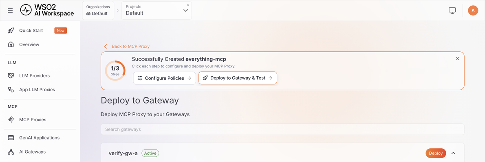

# Get started with AI Workspace

AI Workspace, hosted by WSO2, lets you manage the AI Gateways, large language model (LLM) providers, and Model Context Protocol (MCP) servers your applications call. It's the control plane that configures those gateways, providers, and proxies, then deploys the configuration to the gateway.

## Overview

This guide walks you through:

1. [Set up your workspace](#part-1-set-up-your-workspace): create an organization in the Console.
2. [Connect an AI Gateway](#part-2-connect-an-ai-gateway): register a gateway and start it.
3. [Configure an LLM provider](#part-3-configure-an-llm-provider): connect a provider, add a model, deploy it, and generate an API key.
4. [Run your first prompt](#part-4-run-your-first-prompt): send a real chat completion request.
5. [Configure an MCP proxy](#part-5-configure-an-mcp-proxy): proxy a sample MCP server and deploy it.
6. [Call your first MCP tool](#part-6-call-your-first-mcp-tool): send a real tool call and confirm the response.

By the end, you'll have a local AI Workspace deployment managing an AI Gateway connected to both an LLM provider and an MCP server. You'll send a real chat completion request and a real tool call through the resulting endpoints.

It's written for platform engineers, developers, and anyone evaluating a self-hosted AI governance layer. No prior WSO2 API Platform experience is required. For optional background on the concepts this guide uses, see:

- [AI Workspace and how it relates to the AI Gateway](overview.md)
- [LLM providers](llm-providers/overview.md)
- [MCP proxies](mcp-proxies/overview.md)

## Before you start

Complete the following prerequisites:

- A WSO2 API Platform account: sign up at [console.bijira.dev](https://console.bijira.dev/) with Google, GitHub, Microsoft, or email. The free trial covers this guide.
- Install [Docker](https://docs.docker.com/get-docker/) with the Compose plugin, on the machine where the gateway will run, or another Compose-compatible container runtime such as Podman.
- Port `8443` free on that machine, for the gateway's HTTPS listener.
- Install `curl` and `unzip`.
- An API key from an LLM provider. This guide uses Mistral AI as the worked example, but any of the six built-in providers works. Sign up with your chosen provider and generate a key before [Part 3](#part-3-configure-an-llm-provider).

This guide shows commands with `docker compose`. If you use Podman or another Compose-compatible runtime, run the equivalent Compose command instead, such as `podman compose up -d`.

## Part 1: Set up your workspace

Everything in the platform lives under an *organization*, which you create once, in the Console.

### Step 1: Create your organization

1. Go to [console.bijira.dev](https://console.bijira.dev/) and sign in. If you already have an organization, open it from the **Organization** menu and skip to [Part 2](#part-2-connect-an-ai-gateway).
2. On first sign-in, enter a name for your organization, accept the Privacy Policy and Terms of Use, and click **Create**.

    

### Step 2: Choose what to build

1. When asked to select a region, keep the default and click **Get Started** (you can add your own data plane later).
2. On **What do you want to build?**, select **AI Service**, then click **Next**.

    

The Console provisions a **Default** project with **Development** and **Production** environments, then opens AI Workspace in a new tab. AI Workspace opens on a guided setup page. Click **Skip and go to Console** to follow this guide's steps directly.

## Part 2: Connect an AI Gateway

An AI Gateway is the runtime that routes requests to LLM providers and MCP servers. You need at least one connected and active before you can send a real request. This part registers a gateway in AI Workspace, then installs and starts its runtime so it shows a status of **Active**.

### Step 7: Register the gateway

1. Navigate to **AI Gateways** in the left navigation menu.
2. Click **Add AI Gateway**.
3. Fill in the gateway details:
    - **Gateway Version**: leave this at its default selection.
    - **Name**: a unique name, for example `local-test-gateway`.
    - **Description**: optional.
    - **URL**: the address the gateway is reachable at once it's running, for example `https://localhost:8443`. AI Workspace uses this to build the Invoke URL and MCP Proxy URL you'll call from your own terminal later in this guide. Use an address your terminal can actually reach, not `host.docker.internal`. That hostname only resolves from inside a container, not from your host machine.

4. Click **Add Gateway**.

AI Workspace creates the gateway with a status of **Inactive** and opens a **Get Started** section. This section carries the gateway installation commands for four methods:

- **Quick Start**
- **Virtual Machine**
- **Docker**
- **Kubernetes**

Its **Configure the gateway** command includes a single-use registration token. This guide uses **Quick Start**. For the other methods, see [Set up an AI Gateway](ai-gateways/setting-up.md).

!!! danger "The registration token is issued once"
    In [Step 8](#step-8-install-and-start-the-gateway), copy the **Configure the gateway** command with its **Copy** button so you capture the token with it. If you lose the token, click **Reconfigure** on the gateway's page to issue a new one. Reconfiguring revokes the previous token.

### Step 8: Install and start the gateway

1. **Download the gateway:**

    ```bash
    curl -sLO https://github.com/wso2/api-platform/releases/download/ai-gateway/v1.2.0/wso2apip-ai-gateway-1.2.0.zip && \
    unzip wso2apip-ai-gateway-1.2.0.zip
    ```

2. **Set up the gateway.** This one-time script provisions the Advanced Encryption Standard (AES)-256 at-rest encryption key, the gateway's HTTPS listener certificate, the gateway-controller admin credentials, and `api-platform.env`. Like AI Workspace, the gateway fails closed if any of these is missing. The admin password is printed once. Copy it: it authenticates directly to the gateway controller, which this guide doesn't use again.

    ```bash
    cd wso2apip-ai-gateway-1.2.0 && ./scripts/setup.sh
    ```

    !!! note "Running on Windows"
        Use the PowerShell setup script instead. It takes the same flags and provisions the same files:

        ```powershell
        cd wso2apip-ai-gateway-1.2.0
        powershell -ExecutionPolicy Bypass -File .\scripts\setup.ps1
        ```

3. **Configure the gateway.** In the **Get Started** section, click the **Copy** button on the **Configure the gateway** command, then run it from the gateway directory. It appends the Platform API address and your single-use registration token to `api-platform.env`:

    ```bash
    cat >> api-platform.env << 'ENVFILE'
    APIP_GW_CONTROLLER_CONTROLPLANE_HOST=host.docker.internal:9243
    APIP_GW_CONTROLLER_CONTROLPLANE_TOKEN=<your-gateway-token>
    ENVFILE
    ```

    The command you copy has your real token in place of `<your-gateway-token>`. The control plane host is a bare `host:port`, with no scheme. Unlike the earlier warning about `host.docker.internal`, this is the reverse direction: the gateway container reaches out to the Platform API on your host machine. That's exactly what that hostname is for.

    !!! note "Running on Windows"
        The heredoc above (`<< 'ENVFILE'`) doesn't work in PowerShell. Either run this step from Git Bash or WSL, or open `api-platform.env` in a text editor and add the two lines directly.

4. **Start the gateway.** It runs in the foreground, so use a second terminal for the rest of this guide, or add `-d` to start it in the background.

    ```bash
    docker compose up
    ```

Give the gateway a few seconds to start and register itself. Back in AI Workspace, the gateway's status changes from **Inactive** to **Active**:


## Part 3: Configure an LLM provider

An LLM provider connects AI Workspace to an AI service platform, such as OpenAI, Anthropic, or Mistral AI. This part creates a provider, allows a model, deploys the provider to your gateway, and generates an API key.

### Step 9: Configure an LLM provider

This section configures Mistral AI as a worked example. The same steps apply to any of the seven built-in providers.

1. Navigate to **LLM Providers** in the left navigation menu, then click **Create Provider**.
2. Select a provider tile. The built-in options are **Anthropic**, **AWS Bedrock**, **Azure AI Foundry**, **Azure OpenAI**, **Gemini**, **Mistral**, and **OpenAI**. Select **Mistral**.
3. Fill in the provider form:
    - **Name**: for example, `Mistral Provider`.
    - **Version**: pre-filled, for example `v1.0`.
    - **Description**: optional.
    - **Context**: the URL path segment this provider is reachable under, for example `/mistral`.
    - **API Key**: your Mistral AI API key. Mistral's endpoint URL is pre-configured automatically.

    

    The **Guardrails & Policies** panel pre-selects a suggested `llm-cost` guardrail. Leave it, remove it, or add more later from the provider's **Guardrails & Policies** tab. See [Policies overview](policies/overview.md).

4. Click **Add Provider**.

AI Workspace encrypts the API key before storing it. The plaintext value is never saved. See [Secrets management](secrets-management.md) for how that works. AI Workspace also imports the provider's OpenAPI specification automatically. It shows a progress tracker with three remaining steps: **Add Guardrails**, **Deploy to Gateway**, and **Consume LLM Provider**. For other providers, including the Azure OpenAI, Azure AI Foundry, and AWS Bedrock fields, see [Configure an LLM provider](llm-providers/configure-provider.md).

### Step 10: Add a model

The provider's **Models** tab lists the models available through it.

1. On the provider's page, click the **Models** tab.
2. Confirm `mistral-small-latest` is already listed as a chip. Mistral ships with a few common models available by default. To add a different model instead, type its ID into the input field and press <kbd>Enter</kbd> to add it as a chip.

3. Click **Save**.

### Step 11: Deploy the provider

1. On the provider's page, click **Deploy to Gateway** in the top right corner. This opens a dedicated deployment page listing your gateways.
2. Confirm the gateway from [Part 2](#part-2-connect-an-ai-gateway) shows a status of **Active**, then click **Deploy** next to it.

The deployment status changes to **Active** within a few seconds, without needing to refresh the page:


### Step 12: Generate an API key

The **API Keys** section on the provider's **Overview** tab only appears once the provider is deployed to at least one gateway. You won't see it before this point.

1. Go back to the provider's **Overview** tab.
2. Under **Invoke URL**, select your gateway from the **Gateways** dropdown and copy the URL shown, for example `https://localhost:8443/mistral`.
3. Under **API Keys**, click **Generate API Key**.
4. Enter a **Key Name**, for example `quickstart-test-key`, and click **Generate**.

    

!!! danger "Copy the key"
    An API key is displayed only once, in a dialog that also shows a ready-to-run `curl` command using one of the provider's models. Store the key securely immediately. You can't retrieve it again, though you can always generate a new one.

## Part 4: Run your first prompt

This part sends a real chat completion request through your deployed provider and confirms the response.

All requests to the gateway authenticate with the `X-API-Key` header by default. This is the same header named on the provider's **Security** tab. Mistral AI exposes an OpenAI-compatible API at `/v1`, so append that to the Invoke URL to reach the chat completions resource.

The following example assumes the Mistral AI provider from Part 3. If you configured a different kind of provider instead, this exact request path and body don't apply. Anthropic, Gemini, Azure OpenAI, and Azure AI Foundry each use their own native request shape. See [Invoke providers and proxies via SDKs](using-sdks.md) for the equivalent call. AWS Bedrock isn't covered there; check your model's Bedrock API documentation for the request format.

```bash
curl -k -X POST "<INVOKE_URL>/v1/chat/completions" \
  -H "Content-Type: application/json" \
  -H "X-API-Key: <YOUR_GENERATED_API_KEY>" \
  -d '{
    "model": "mistral-small-latest",
    "messages": [
      { "role": "user", "content": "Say hello in exactly five words." }
    ]
  }'
```

!!! tip "Certificate warning?"
    The `-k` flag accepts the gateway's self-signed certificate, the one its own `setup.sh` generated in [Step 8](#step-8-install-and-start-the-gateway).

A successful response returns `200 OK` with a chat completion:

```json
{
  "id": "7e22aefb0dac4c3ba1080d34ad8a3da5",
  "object": "chat.completion",
  "created": 1786112464,
  "model": "mistral-small-latest",
  "choices": [
    {
      "index": 0,
      "finish_reason": "stop",
      "message": {
        "role": "assistant",
        "content": "Hello there, how are you?"
      }
    }
  ],
  "usage": { "prompt_tokens": 10, "completion_tokens": 9, "total_tokens": 19 }
}
```

Your `id`, `created` timestamp, and `content` will differ. A `200` status with a `choices` array confirms the request reached Mistral through your gateway.

At this point, you have a local AI Workspace deployment managing an AI Gateway connected to Mistral AI. You just sent a real chat completion through that gateway with a key you generated yourself. AI Workspace, the AI Gateway, and the upstream provider all worked together to complete that request.

## Part 5: Configure an MCP proxy

An MCP proxy exposes a Model Context Protocol (MCP) server through AI Workspace, so the tools, resources, and prompts it provides go through the same authentication and governance as your LLM traffic. This part creates a proxy from a hosted sample MCP server, then deploys it to your gateway.

### Step 13: Create an MCP proxy

AI Workspace includes a hosted sample MCP server, so you don't need to run one yourself. Because AI Workspace runs on your own machine in this guide, it can also reach an MCP server you run locally. If you have one, paste its URL instead of using the sample. Add credentials under **Advanced Configurations** if the server needs them.

1. Navigate to **MCP Proxies** in the left navigation menu, then click **Create MCP Proxy**.
2. Click **Try with Sample URL**, then click **Fetch Server Info**.

    AI Workspace fetches the server's capabilities and lists them: 4 tools (including `echo` and `add`), 10 resources, and 3 prompts.

3. Click **Next**.
4. Fill in the proxy details:
    - **Name**: a unique name, for example `everything-mcp`.
    - **Version**: pre-filled, for example `v1.0`.
    - **Description**: optional.
    - **Context**: pre-filled from the name, for example `/default/everything-mcp`.
    - **Target**: pre-filled with the server URL from step 2.
5. Click **Create**.

AI Workspace shows a progress tracker with the remaining steps: **Configure Policies** and **Deploy to Gateway & Test**. See [MCP proxies overview](mcp-proxies/overview.md) for what each capability type means.

### Step 14: Deploy the proxy

1. On the proxy's page, click **Deploy to Gateway** in the top right corner. This opens a dedicated deployment page listing your gateways.
2. Confirm the gateway from [Part 2](#part-2-connect-an-ai-gateway) shows a status of **Active**, then click **Deploy** next to it.

The deployment status changes to **Active** within a few seconds:



## Part 6: Call your first MCP tool

This part sends a real tool call through your deployed MCP proxy and confirms the response.

Go back to the proxy's **Overview** tab. Under **MCP Proxy URL**, copy the URL shown, for example `https://localhost:8443/default/everything-mcp/mcp`.

Every MCP client starts a session with an `initialize` request before it can call a tool. Replace `<MCP_PROXY_URL>` with the URL you copied, then run:

```bash
curl -ki -X POST "<MCP_PROXY_URL>" \
  -H "Content-Type: application/json" \
  -H "Accept: application/json, text/event-stream" \
  -d '{
    "jsonrpc": "2.0",
    "id": 1,
    "method": "initialize",
    "params": {
      "protocolVersion": "2025-06-18",
      "capabilities": {},
      "clientInfo": { "name": "getting-started", "version": "1.0.0" }
    }
  }'
```

The `-i` flag prints the response headers. Copy the `Mcp-Session-Id` value. You need it for the next command.

Call the sample `add` tool. Replace `<MCP_PROXY_URL>` and `<SESSION_ID>` with your values:

```bash
curl -k -X POST "<MCP_PROXY_URL>" \
  -H "Content-Type: application/json" \
  -H "Accept: application/json, text/event-stream" \
  -H "Mcp-Session-Id: <SESSION_ID>" \
  -d '{
    "jsonrpc": "2.0",
    "id": 2,
    "method": "tools/call",
    "params": { "name": "add", "arguments": { "a": 4, "b": 5 } }
  }'
```

A successful response returns `200 OK` with the tool's actual output:

```text
event: message
data: {"result":{"content":[{"type":"text","text":"The sum of 4 and 5 is 9."}]},"jsonrpc":"2.0","id":2}
```

That result means your request reached the sample server's `add` tool and came back through the gateway. To explore the other tools interactively, point an MCP client such as [MCP Inspector](https://github.com/modelcontextprotocol/inspector) at the same URL.

The sample proxy has no authentication policy, so these calls need no key. Add the [MCP Authentication policy](mcp-proxies/apply-policies.md) to require one.

At this point, you also have that same AI Gateway routing governed traffic to an MCP server, alongside the LLM provider from Part 3. AI Workspace configures both from one place.

## Verify everything works end to end

To confirm every piece is in place:

- [ ] You can sign in to AI Workspace and see your organization in the Console.
- [ ] An AI Gateway is registered and shows a status of **Active**.
- [ ] An LLM provider is configured with at least one model on its **Models** tab.
- [ ] The provider is deployed to your gateway, with a deployment status of **Active**.
- [ ] A generated API key successfully authenticates a real chat completion request through the gateway.
- [ ] An MCP proxy is configured and deployed to your gateway, with a deployment status of **Active**.
- [ ] An `initialize` request and a `tools/call` request both succeed against the MCP proxy's URL.

From here, every change you make in AI Workspace (a guardrail, a rate limit, an extra model, another back end) is pushed to the gateway without touching client code. Callers keep using the same URLs and keys.

## Troubleshooting

If something doesn't work as expected, check here before anything else:

| Symptom | Likely cause | Fix |
|---|---|---|
| Gateway stays **Inactive** | Can't reach `connect.bijira.dev`, or the token in `keys.env` is incorrect. | Check the `docker compose` logs. Click **Reconfigure** on the gateway's page for a new token, update `keys.env`, and restart. See [Set up an AI Gateway](ai-gateways/setting-up.md). |
| First LLM request returns `504 upstream request timeout` | The gateway hasn't received the latest configuration yet. | Wait about a minute and retry. |
| LLM request returns `401` | The `X-API-Key` header is missing or incorrect. | Use the key from [Part 3](#part-3-configure-an-llm-provider), exactly as generated. |
| MCP `initialize` request fails or times out | The gateway isn't running, or the URL is wrong. | Confirm `docker compose` is still running, and that you copied the full **MCP Proxy URL**. |
| Creating an MCP proxy from your own server fails to fetch info | AI Workspace can't reach that URL from its hosted side. | Use a publicly reachable URL, or click **Try with Sample URL** instead. |

## Next steps

- [Manage an LLM provider](llm-providers/manage-provider.md): configure connection, access control, security, rate limiting, and guardrails for the provider you just created
- [Configure an App LLM Proxy](llm-proxies/configure-proxy.md): add an application-specific endpoint on top of a provider, with its own guardrails and access rules
- [Manage an App LLM Proxy](llm-proxies/manage-proxy.md): configure provider settings, resources, security, and guardrails for an existing proxy
- [Invoke providers and proxies via SDKs](using-sdks.md): call your deployed endpoint from the OpenAI, Anthropic, Gemini, Mistral, Azure OpenAI (including Azure AI Foundry), or LangChain software development kits (SDKs)
- [Apply MCP policies](mcp-proxies/apply-policies.md): add authentication, authorization, and access control to the MCP proxy you just created
- [GenAI applications](genai-applications.md): group API keys under a named application for usage visibility and governance
- [Change the ports AI Workspace uses](setting-up/ports.md): remap the default `9643` and `9243` ports
- [Connect a database to the Platform API](setting-up/database.md): move off the default SQLite store to PostgreSQL or SQL Server for production
- [Authentication in AI Workspace](setting-up/authentication/overview.md): connect an identity provider before sharing this instance with a team
- [Configure inbound authentication](configure-inbound-auth.md): change the header name your applications use to call a provider or proxy
- [AI Workspace CI/CD overview](ci-cd/overview.md): manage providers and proxies as version-controlled files with the `ap` command-line interface (CLI)
- [Production deployment overview](production/overview.md): take this deployment to a virtual machine or Kubernetes, with high availability and hardening
- [Troubleshoot AI Workspace](troubleshooting.md): fixes for the most common setup problems
